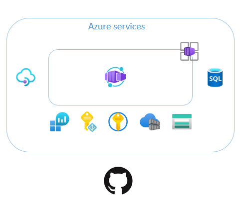

# Challenge 1: Setup the environment

You will use Bicep to deploy the Azure services that you will work with. Bicep is a declarative language that sits on top of Azure Resource Manager (ARM). There are many similarities to Terraform but one big difference is that it doesn't require any state management.
You also need to add GitHub secrets that will be used in later challenges.    
 

  

 

## Main objectives

- Create the Azure services that you will use during the hackathon.
- Add GitHub secrets to your repository. 

## Activities

- Fork and clone the repo to your local computer.
- Create a resourcegroup or use the provided one with the naming convention "rg-[six letters]" e.g. "rg-wilnor"." in the northeurope Azure region. 
- Deploy infrastructure/main.bicep and validate that all services deployed successfully. 
- Add the following GitHub secrets

    - AZURE_BLOB_SAS_TOKEN - Use the created storage account. Create a SAS token for the container "apidefinitions" with read access. Use the value from the field "Blob SAS token".
    - AZURE_CREDENTIALS - Use the JSON output from the Azure CLI command "az ad sp create-for-rbac", set the scope to the previously created resourcegroup.
    - AZURE_RG - The name of the previously created resourcegroup.
    - AZURE_STORAGE_CONNECTION_STRING - The connection string to the created storage account, put the connection string inside **double quotes**. e.g. "[YOUR STORAGE ACCOUNT CONNECTION STRING]"
    - AZURE_SUBSCRIPTION - The subscription Id 

## Definition of done

- Deployment of infrastructure/main.bicep executed successfully.
- Five GitHub secrets created according to instructions. 

## Helpful links

- [How to deploy resources with Bicep and Azure CLI](https://learn.microsoft.com/en-us/azure/azure-resource-manager/bicep/deploy-cli)
- [GitHub secrets](https://docs.github.com/en/actions/security-guides/encrypted-secrets)
- [Strong Passwords - Azure SQL](https://learn.microsoft.com/en-us/sql/relational-databases/security/strong-passwords?view=sql-server-ver16)

## Solution
- View the solution here, [Challenge 1 - Solution](solution1.md) 

## The challenges

* [Challenge 1: Setup the environment](challenge1.md)
* [Challenge 2: Get familiar with Azure API Management (APIM)](challenge2.md)
* [Challenge 3: Use Bicep for deployment to APIM](challenge3.md)
* [Challenge 4: Create a CI/CD GitHub Action and deploy to Container Apps](challenge4.md)
* [Challenge 5: Use the CI/CD GitHub Action to deploy changes to APIM](challenge5.md)
* [Challenge 6: Add a policy using Bicep](challenge6.md)
* [Challenge 7: Managing Development/Production environments.](challenge7.md)