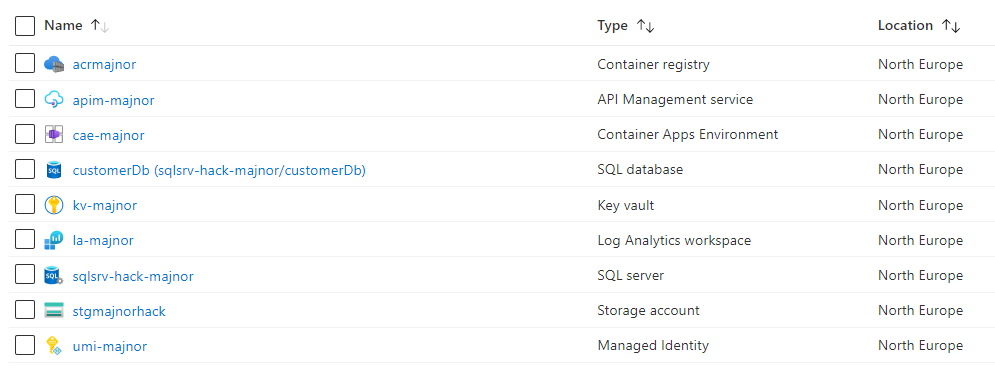
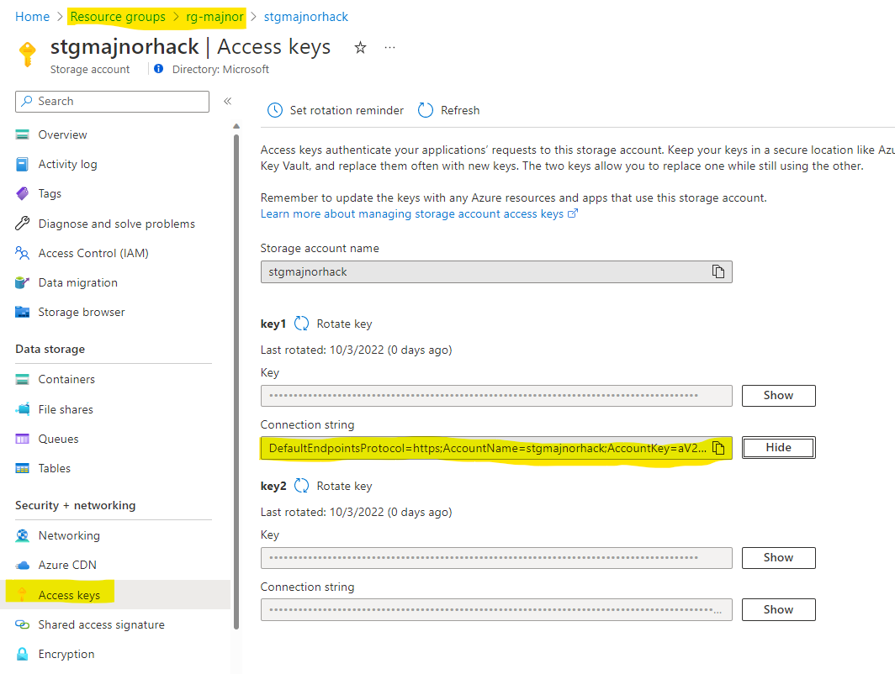
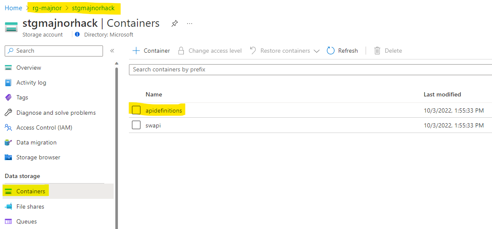
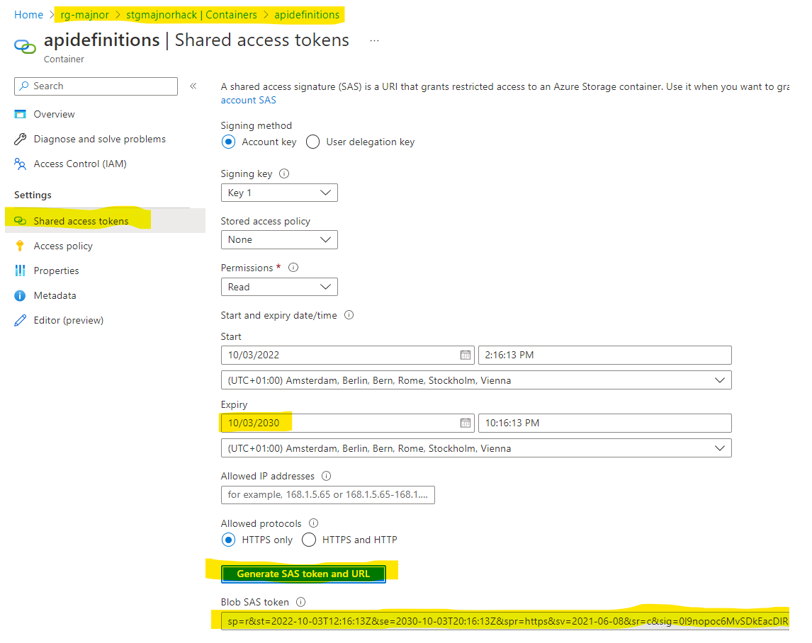
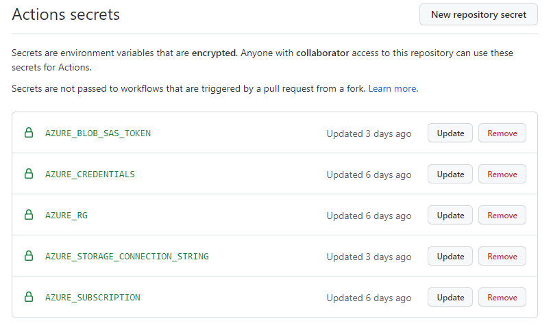

# Challenge 1 - Solution

## Solution steps

To setup the environment you will use Azure CLI from VS Code.
Either use a Service Principal or a user that has Owner rights on the subscription. The owner RBAC is required because you will create a User Assigned Managed Identity and apply role assignments to the identity.

> **Note**
> You may run the deployment steps as a user with Owner rights but a Service Principal is still required when configuring the GitHub Actions.
> 


### Login to Azure 
<br>

Open the cloned folder in VS Code and use a Terminal in VS Code for all the Azure CLI commands.  

> **Note**
> 
> If you are using bash you need to use single quotes '' for app-id, password and tenant. 
>


Login to Azure using a Service Principal

```shell
az login --service-principal -u <app-id> -p <password> --tenant <tenant>
```
Login to Azure using a user

```shell
az login --tenant <tenant>
```

Make sure that you are in the right subscription by running. 
```shell
az account show
```

> **Note**
> 
> If you need to create a Service Principal you need to be logged in and run the following command. 
>
>```shell
>az ad sp create-for-rbac --name [NAME OF SP] --role owner --scopes /subscriptions/[YOUR SUBSCRIPTION ID] --sdk-auth
>```
>
>Save the output, you will need it later. 

### Create a resourcegroup
<br>
Create a resourcegroup using Azure CLI. Choose a six letters that will be used through the hackathon, it will be a postfix for all service names. For example, use you first three letters of your firstname and lastname. e.g "John Doe" --> johdoe. 

<br>

Important, use only small caps for your postfix.

<br>

All services will be created in North Europe datacenter region. If you prefer another region make sure all services are available there. 

```shell
az group create -n rg-[YOUR POSTFIX] -l northeurope
```

### Deploy the services
<br>

The bicep files for all services to be used are in the infrastructure/ folder. When using Bicep a common pattern is to have a main.bicep file and reference modules from inside the main.bicep file. Set a sql password of your choice for example, This1sMy3ecretPwd!x

```shell
az deployment group create -g rg-[YOUR POSTFIX] -f infrastructure/main.bicep -p name=[YOUR POSTFIX] sqlpwd=[A SECRET FOR SQL DATABASE]
```

The deployment takes normally 3-4 minutes, and the result should look similar to this. 



### Add GitHub secrets

Now you are going to add five secrets that will be used for the GitHub Action workflow. Login to your GitHub account and navigate to Settings --> Secrets --> Actions 

Click "New repository secret" 
Open a new tab in your browser and go to the Azure portal. 

***AZURE_STORAGE_CONNECTION_STRING***

Navigate to the Azure portal and get the connectionstring for the storage account in your resourcegroup. Put it inside **double quotes** "[YOUR Connection string]" and save it as a GitHub secret.   



***AZURE_BLOB_SAS_TOKEN***

Navigate to the Azure portal and the storage account in your resourcegroup. Go to Containers --> "apidefinitions" --> Shared access tokens. 
Change the Expiry date to something far away in the future. 
Click "Generate SAS token and URL"
Copy the "Blob SAS token" and save it as a GitHub secret.



<br>




***AZURE_CREDENTIALS***

Here you need the full output from the service principal when it was created using the command "az ad sp create-for-rbac --name [NAME OF SP] --role owner --scopes />subscriptions/[YOUR SUBSCRIPTION ID] --sdk-auth", its a JSON payload that consist of information to authenticate against Azure. It should have the structure like this. 

```json
{
  "clientId": "[AZURE AD CLIENTID]",
  "clientSecret": "[AZURE AD SECRET]",
  "subscriptionId": "[SUBSCRIPTION ID]",
  "tenantId": "[TENANT ID]",
  "activeDirectoryEndpointUrl": "https://login.microsoftonline.com",
  "resourceManagerEndpointUrl": "https://management.azure.com/",
  "activeDirectoryGraphResourceId": "https://graph.windows.net/",
  "sqlManagementEndpointUrl": "https://management.core.windows.net:8443/",
  "galleryEndpointUrl": "https://gallery.azure.com/",
  "managementEndpointUrl": "https://management.core.windows.net/"
}
```
Paste the full JSON payload into the secret. 

***AZURE_RG***

Your resourcegroup rg-[YOUR POSTFIX]

***AZURE_SUBSCRIPTION***

The subscription id

The result should look like this. 



## The challenges

* [Challenge 1: Setup the environment](challenge1.md)
* [Challenge 2: Get familiar with Azure API Management (APIM)](challenge2.md)
* [Challenge 3: Use Bicep for deployment to APIM](challenge3.md)
* [Challenge 4: Create a CI/CD GitHub Action and deploy to Container Apps](challenge4.md)
* [Challenge 5: Use the CI/CD GitHub Action to deploy changes to APIM](challenge5.md)
* [Challenge 6: Add a policy using Bicep](challenge6.md)
* [Challenge 7: Managing Development/Production environments.](challenge7.md)