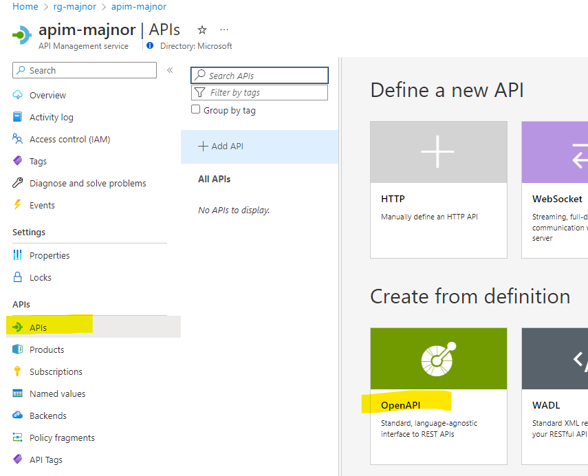
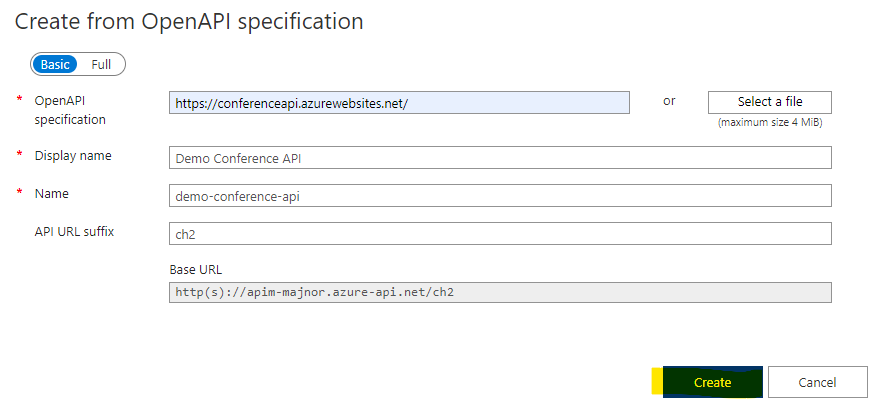
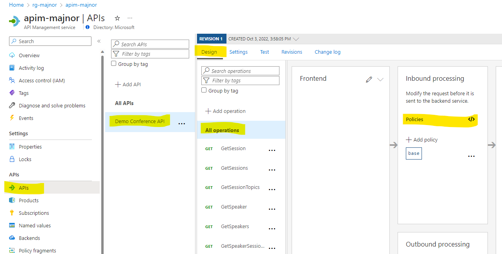
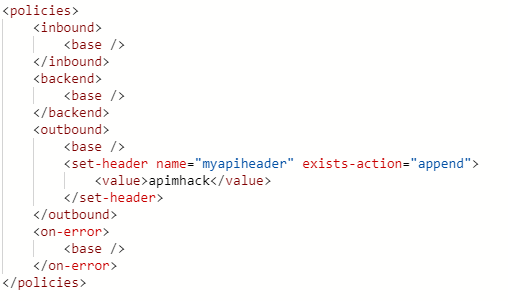
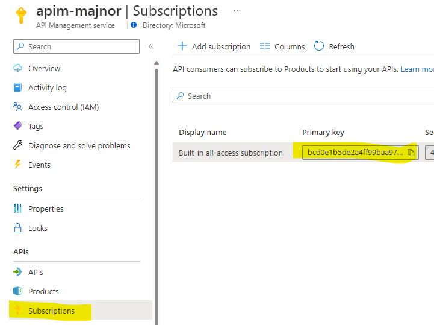
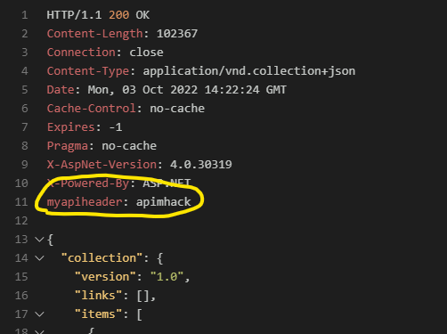

# Challenge 2 - Solution

## Solution steps

Go to APIM in the Azure portal and click API --> OpenAPI



<br>Use the publicly available conference api, https://conferenceapi.azurewebsites.net/. 
Display name and name will be populated when you enter the url, set API URL suffix to "ch2", click "Create".



<br>Choose the imported API and navigate to All Operations --> Policies then the Policy editor opens up. 



<br> Add the setheader policy in the outbound section below the "base" tag. 

```xml
<set-header name="myapiheader" exists-action="append">
    <value>apimhack</value>
</set-header>
```


Validate the configuration by using VS Code "REST Client" extension.  
Go get your subscription key under Subscriptions --> Context menu to the right --> 
Show/hide keys, copy the primary key.  




Create a file called "validate.http" in the root of your repo. When you have added the [POSTFIX] and your subscription key click send request.  

```
https://apim-[POSTFIX].azure-api.net/ch2/sessions
Ocp-Apim-Subscription-Key: <Place subscription key here>
```

Validate that the request header "myapiheader" has been added to the response. 



## The challenges

* [Challenge 1: Setup the environment](challenge1.md)
* [Challenge 2: Get familiar with Azure API Management (APIM)](challenge2.md)
* [Challenge 3: Use Bicep for deployment to APIM](challenge3.md)
* [Challenge 4: Create a CI/CD GitHub Action and deploy to Container Apps](challenge4.md)
* [Challenge 5: Use the CI/CD GitHub Action to deploy changes to APIM](challenge5.md)
* [Challenge 6: Add a policy using Bicep](challenge6.md)
* [Challenge 7: Managing Development/Production environments.](challenge7.md)