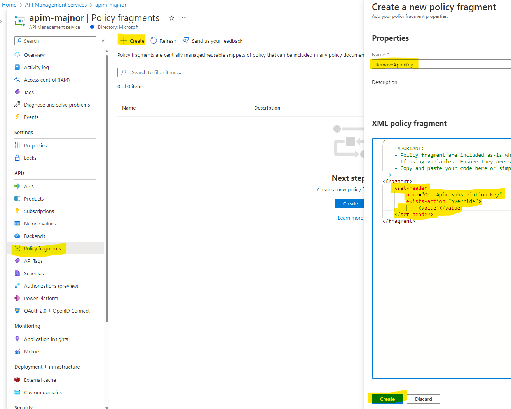
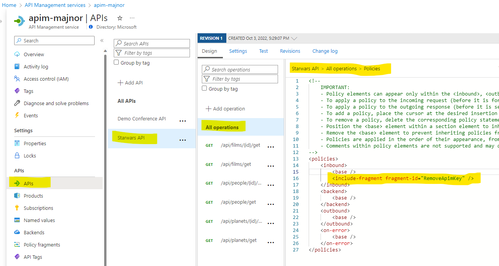
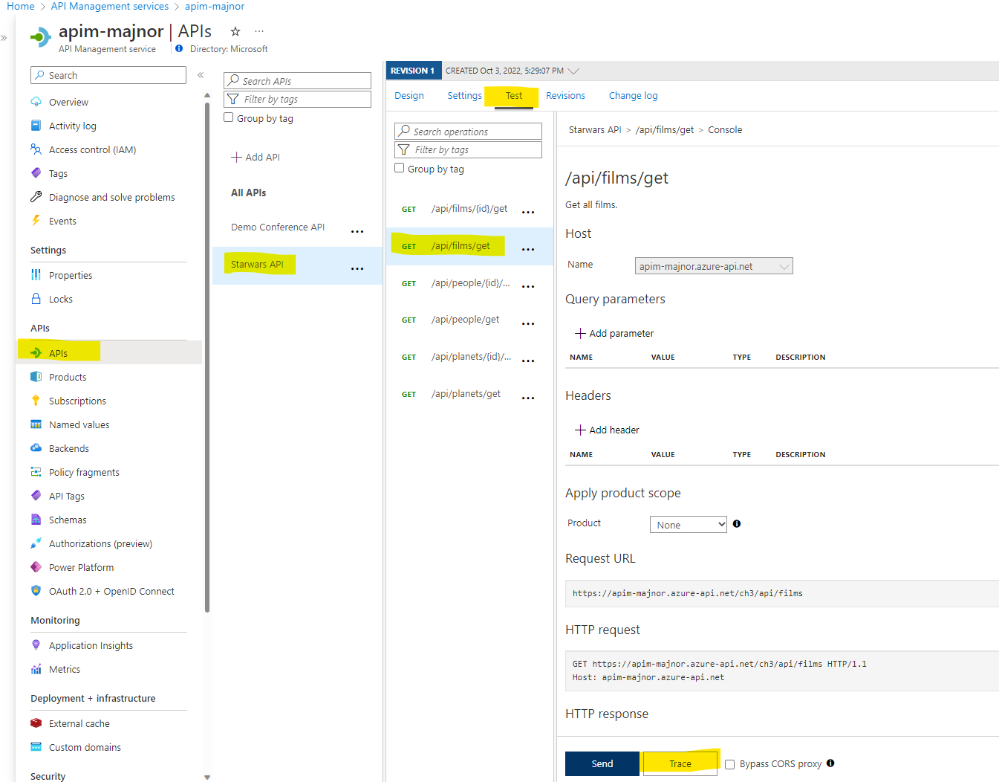
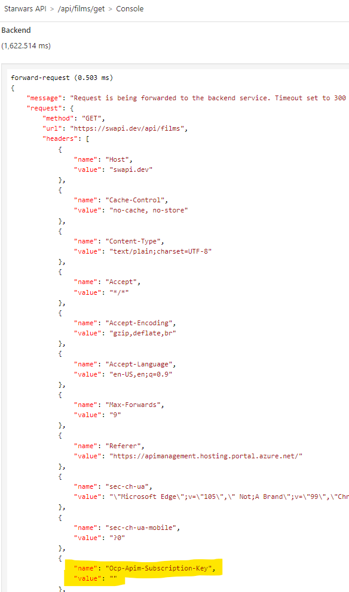

# Challenge 3 - Solution

## Solution steps

Upload the swagger file using Azure CLI

```bash
az storage blob upload -f .\swapi-swagger.json --account-name stg[POSTFIX]hack -c swapi
```

Create a new Bicep file called "swapi.bicep" and place it in the infrastructure folder in the repo. 

Create a parameter section. 

```bash
param name string
```

Use the **existing** keyword in the end of the reference declaration to reference the APIm instance. 


```bicep
resource apim 'Microsoft.ApiManagement/service@2021-08-01' existing = {
  name: 'apim-${name}'
}
```

Create the Starwars API using Bicep

```bicep
resource swapi 'Microsoft.ApiManagement/service/apis@2021-08-01' = {
  parent: apim
  name: 'swapi'
  properties:{
    format: 'openapi+json-link'
    value: 'https://stg${name}hack.blob.core.windows.net/swapi/swapi-swagger.json'
    displayName: 'Starwars API'
    path: 'ch3'
    protocols:[
      'https'
    ]
    apiType:'http'
  }
}
```

Create an APIM subscription and connect it to the Starwars API. 

```bicep
resource subscription 'Microsoft.ApiManagement/service/subscriptions@2021-12-01-preview' = {
  name: 'swapi-sub'
  parent: apim
  properties: {
    scope: '/apis/swapi'
    displayName: 'swapi-sub'
    allowTracing: true
  }
  dependsOn: [
    swapi
  ]
}
```

For the complete Bicep file see [docs/ch3.bicep](ch3.bicep). 

Deploy the swapi.bicep file using Azure CLI.

```bash
az deployment group create -g rg-[POSTFIX] -f infrastructure/swapi.bicep -p name=[POSTFIX]
```

Validate that the Starwars API has been deployed successfully using the Azure portal. 

Add a policy fragment and set the name "RemoveApimKey", add the following policy. 

```xml
<set-header name="Ocp-Apim-Subscription-Key" exists-action="override">
	<value> </value>
</set-header>
```



Add a reference to the policy fragment in the Starwars API for all operations. Place it in the inbound section so the policy is applied before the request to the backend api. 

```xml
<include-fragment fragment-id="RemoveApimKey" />
```



Validate that the policy is applied by using the test console in APIM and click "Trace" on the "/api/films/get" operation, if a popup window is shown choose enable tracing and click the "Trace" button. 



Scroll down to the backend part of the trace logs and validate that the subscription key has been removed by the policy. 



## The challenges

* [Challenge 1: Setup the environment](challenge1.md)
* [Challenge 2: Get familiar with Azure API Management (APIM)](challenge2.md)
* [Challenge 3: Use Bicep for deployment to APIM](challenge3.md)
* [Challenge 4: Create a CI/CD GitHub Action and deploy to Container Apps](challenge4.md)
* [Challenge 5: Use the CI/CD GitHub Action to deploy changes to APIM](challenge5.md)
* [Challenge 6: Add a policy using Bicep](challenge6.md)
* [Challenge 7: Managing Development/Production environments.](challenge7.md)