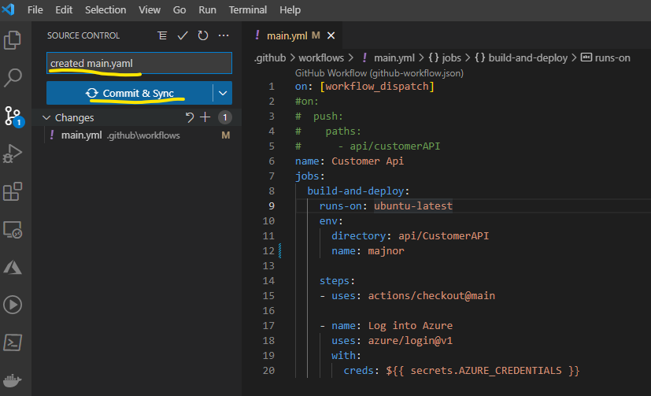
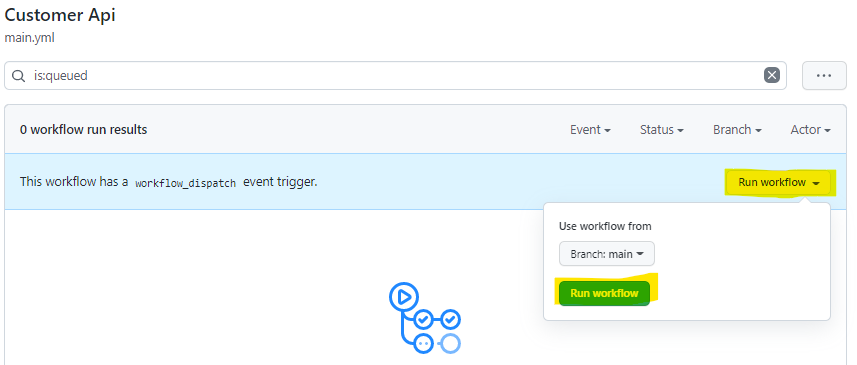
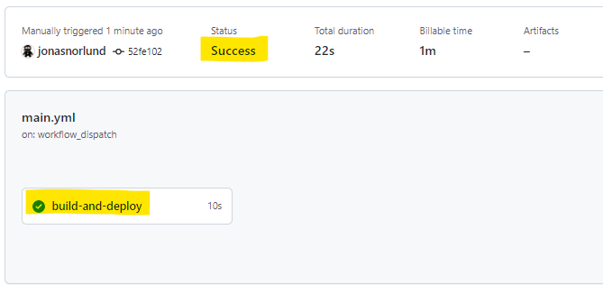
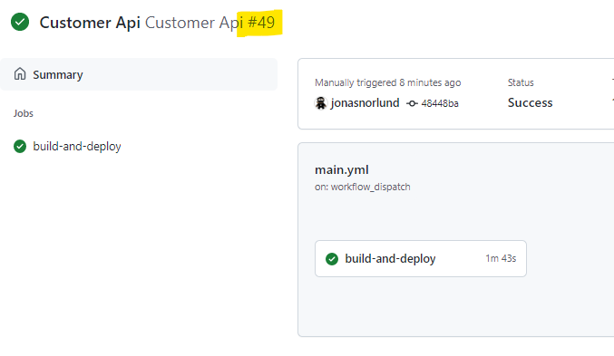
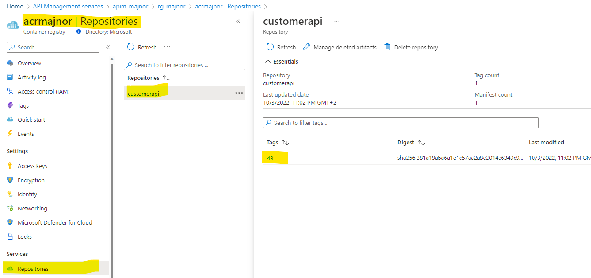
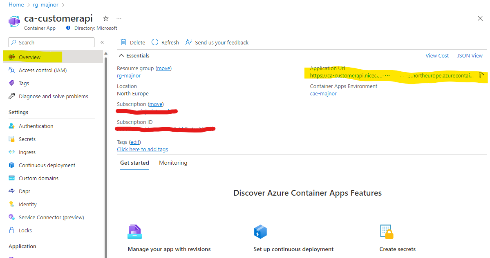
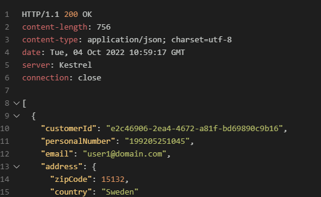

# Challenge 4 - Solution

## Solution steps

Start with creating an empty main.yml file in .github/workflows/
The GitHub Action wokflow that you will create consists of the following parts: trigger, name, environment variables, job and steps. 
The first part includes trigger, name and jobs
Make sure you set your postfix by replacing [YOUR POSTFIX].
It's very important that the structure (indentation) is correct in the yaml file. You could use [http://www.yamllint.com](http://www.yamllint.com) to validate your yaml file.

```yaml
on:
  push:                             # Workflow will start when code is pushed into this repo
    paths:
      - 'api/CustomerAPI/**'          # Only changes in and below this path will trigger this workflow
      - '.github/workflows/*'

name: Customer Api                  # Name of the workflow
jobs:
  build-and-deploy:
    runs-on: ubuntu-latest          # Base image to be used for the GitHub runner
    env:                            # List of environment variables
      directory: api/CustomerAPI    # the path of the Customer API 
      name: [YOUR POSTFIX]          # Your POSTFIX
```

The next part includes the first steps

```yaml
    steps:
    - uses: actions/checkout@main       # Checkout the code to the GitHub runner 

    - name: Log into Azure              # Log into Azure using the service credentials provided earlier
        uses: azure/login@v1
        with:
        creds: ${{ secrets.AZURE_CREDENTIALS }}
```

When you have added this to the main.yml file it's time to try your workflow but first you will change the trigger part. By setting the trigger to [workflow_dispatch] you will be able to run the workflow without changing the code.  

```yaml
on: [workflow_dispatch]
#on:
#  push:                             # Workflow will start when code is pushed into this repo
#    paths:
#      - 'api/CustomerAPI/**' 
#      - '.github/workflows/*'

```      

Save the main.yml and commit --> push the changes to your repo. 



Navigate to your GitHub repo using a browser and go to Actions --> Run Workflow --> Run Workflow



It takes a couple of seconds until it starts, validate that it succeeds. You can also click in on "build-and-deploy" and see the details. 



Go back to the main.yml and add the following code under the last step. 

```yaml
    - name: Build image with Azure Container Registry
      uses: azure/CLI@v1
      with:
        azcliversion: latest
        inlineScript: |
          az acr build --registry acr${{ env.name }}.azurecr.io --image customerapi:${{ github.run_number }} . -f api/CustomerAPI/Dockerfile 
```

This step uses Azure CLI command "az acr build" to push the code to Azure Container Registry and first build the code and then create a docker image based on the Dockerfile. It uses the GitHub environment variable ${{ github.run_number }} to create a unique tag for the docker image. 

Save main.yml, commit and push the changes to GitHub. Run the workflow manually as you did earlier.

Validate that the workflow succeeded and go to your Azure Container Registry. Compare the run number in GitHub with the tag that has been created in Azure Container Registry. 





Now its time to add the step which deploys the Container App. Add the following code under the latest step.  


```yaml
    - name: Deploy API to Azure Container Apps 
      uses: azure/arm-deploy@v1
      with:
        subscriptionId: ${{ secrets.AZURE_SUBSCRIPTION }}   # Subscription Id
        resourceGroupName: rg-${{ env.name }}               # Resource group
        template: ${{ env.directory }}/Bicep/main.bicep     # File to deploy
        parameters: dockerimagetag=${{ github.run_number }} name=${{ env.name }}  # Parameters
        failOnStdErr: false
```

This step deploys the bicep file api/CustomerAPI/Bicep/main.bicep (which you haven't worked with yet). 

Below is the api/CustomerAPI/Bicep/main.bicep file, it's complete, no changes are needed, but please read through it and make sure you understand what it does.  

```bicep
param name string
param location string = resourceGroup().location
param dockerimagetag string
param apidefinitionurl string = '' 

resource kv 'Microsoft.KeyVault/vaults@2022-07-01' existing = {
  name: 'kv-${name}'
}

module customerapi 'customerapi.bicep' = {
  name: 'customerapiDeploy'
  params: {
    db_connectionstring: kv.getSecret('dbconnection') // Get secret from Azure key vault
    dockerimagetag: dockerimagetag
    name:name
    apidefinitionurl: apidefinitionurl
    location: location
    
  }
}
```

The file follows a very common pattern when working with Bicep files, a main.bicep file and other Bicep files divided up into modules. 

The api/CustomerAPI/Bicep/customerapi.bicep needs some additions. 

Under the params add a variable that you will use at several places later. 

```bicep 
// Variable
var appname = 'ca-customerapi'
```

After that you need to add references to existing resources that you need information from when you are going to deploy a Container App. These are all resources that you created in the first challenge.  

```bicep
// existing resources
resource uami 'Microsoft.ManagedIdentity/userAssignedIdentities@2021-09-30-preview' existing = {
  name: 'umi-${name}'
}

resource acr 'Microsoft.ContainerRegistry/registries@2019-12-01-preview' existing = {
  name: 'acr${name}'
}

resource cae 'Microsoft.App/managedEnvironments@2022-03-01' existing = {
  name: 'cae-${name}'
}

resource apim 'Microsoft.ApiManagement/service@2021-08-01' existing = {
  name: 'apim-${name}'
}
```

The next step is to create the Container App with the Customer API and reference the docker image that you have created. 

```bicep
resource ca_customerapi 'Microsoft.App/containerApps@2022-03-01' = {
  name: appname                         // Name of the Container App
  location: location
  identity: {
    type: 'UserAssigned'
    userAssignedIdentities: {
      '${uami.id}': {}                  
    }
  }
  properties: {
    managedEnvironmentId: cae.id        // reference to the Container Apps Environment that this Container App is going to run in 
    configuration: {
      activeRevisionsMode: 'single'
      ingress: {                  
        external: true                  // Expose an external ingress so yu can reach it from APIM
        targetPort: 80
        allowInsecure: true
        transport: 'auto'
      }
      registries: [
        {
          identity: uami.id             // reference to the managed identity, this is used to authenticate against Azure Container Registry     
          server: acr.properties.loginServer # Azure Container Registry
        }
      ]
      secrets: [
        {
          name: 'dbconnection'
          value: db_connectionstring    // A secret is created based on data from Azure Key vault
        }
      ]
    }
    template: {
      containers: [
        {
          image: '${acr.properties.loginServer}/customerapi:${dockerimagetag}'  // Docker image in ACR with dockerimagetag generated by the GitHub runner
          name: appname                 
          resources: {
            cpu: json('0.25')
            memory: '.5Gi'
          }
          env: [
            {
              name: 'ConnectionStrings__DefaultConnection'
              secretRef: 'dbconnection' // Environment variable that reference to the secret created above
            }
          ]
          
        }
      ]
      scale: {
        minReplicas: 1
        maxReplicas: 1
      }
    }
  }
}
```

Save customerapi.bicep and change the top of main.yml to trigger the workflow when a push has been done to the path below. 

```yaml
#on: [workflow_dispatch]
on:
  push:
    paths:
      - 'api/CustomerAPI/**'
      - '.github/workflows/*'
```

Commit and push the changes and monitor the workflow in GitHub. If the workflow succeeds a Container App should have been created and you can give it a try. 
Use VS Code REST Client, open the previous used file validate.http.  

Copy the generated url of your Container App. 



Between each request you need to add ### in validate.http
###
https://ca-customerapi.[YOUR GENERATED URL].northeurope.azurecontainerapps.io/api/customers

You should see something similar to this, a list of customers.  



## The challenges

* [Challenge 1: Setup the environment](challenge1.md)
* [Challenge 2: Get familiar with Azure API Management (APIM)](challenge2.md)
* [Challenge 3: Use Bicep for deployment to APIM](challenge3.md)
* [Challenge 4: Create a CI/CD GitHub Action and deploy to Container Apps](challenge4.md)
* [Challenge 5: Use the CI/CD GitHub Action to deploy changes to APIM](challenge5.md)
* [Challenge 6: Add a policy using Bicep](challenge6.md)
* [Challenge 7: Managing Development/Production environments.](challenge7.md)
