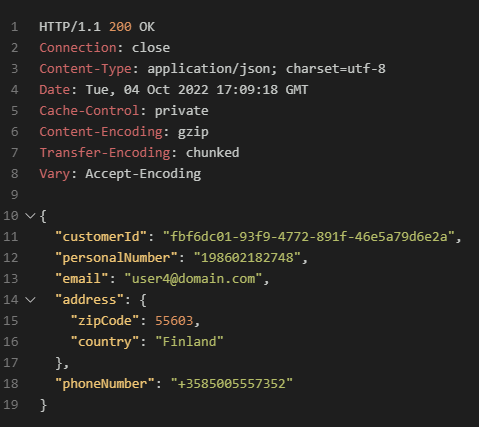

# Challenge 5 - Solution

## Solution steps

In this challenge you will finalize the CI/CD workflow and see it in action when you are going to implement a change in the code. First, you need to generate the swagger definition. 
Add this to your workflow **above** the last step. 

```yaml
    - name: Use dotnet tools to build and generate swagger
      run: |
        dotnet tool restore --tool-manifest .config/dotnet-tools.json
        dotnet restore 
        dotnet build
        dotnet swagger tofile --output $GITHUB_WORKSPACE/api/CustomerAPI/swagger-output/swagger.json $GITHUB_WORKSPACE/api/CustomerAPI/bin/Debug/net6.0/CustomerAPI.dll v1
      working-directory: ${{ env.directory }}
```
This step will build the API and generate a swagger file that you need to upload to a blob storage to use it from Bicep. Add the following code below the code you just added. 

```yaml
    - name: Upload swagger to Azure storage account
      uses: azure/CLI@v1
      with:
        azcliversion: latest
        inlineScript: |
          az storage blob upload -f $GITHUB_WORKSPACE/api/CustomerAPI/swagger-output/swagger.json -n swagger.json -c apidefinitions --overwrite --connection-string ${{ secrets.AZURE_STORAGE_CONNECTION_STRING }}
```
This step uses Azure CLI to upload the generated swagger file to your blob storage. 
Now you need to provide the url to the swagger file as a parameter into the Bicep deployment. 
Replace the parameters line to the code below in the Bicep deployment step (the last step).

```yaml
parameters: dockerimagetag=${{ github.run_number }} name=${{ env.name }} apidefinitionurl=https://stg${{ env.name }}hack.blob.core.windows.net/apidefinitions/swagger.json?${{ secrets.AZURE_BLOB_SAS_TOKEN }}
```
This adds a parameter (apidefinitionurl) to the Bicep deployment, it's the url to the uploaded swagger definition with a SAS token attached to the query.  

The last step is to update customerapi.bicep so it imports the Customer API to APIM. Add this code as the last part to api/CustomerAPI/Bicep/customerapi.bicep  

```bicep
resource api 'Microsoft.ApiManagement/service/apis@2021-08-01' = {
  parent: apim                  // Uses the reference to APIM
  name: 'customerapi'
  properties:{
    serviceUrl: 'https://${ca_customerapi.properties.configuration.ingress.fqdn}' // gets the url from Container Apps
    format: 'openapi+json-link'
    value: apidefinitionurl     // Uses the input parameter from the GitHub workflow. 
    displayName: 'Customer API'
    path: 'ch5'
    protocols:[
      'https'
    ]
    apiType:'http'
  }
}
```

Commit and push the changes, monitor the workflow in GitHub. If the workflow succeeds a new API is created in APIM, validate that it works using validate.http. See [Solution 2](solution2.md) how to get your subscription key.    


```
### 
https://apim-[POSTFIX].azure-api.net/ch5/api/customers
Ocp-Apim-Subscription-Key: <Place subscription key here>
```

You should see the same result as you did earlier when you went directly against the Container App.
Now your CI/CD GitHub workflow is finalized, let's give it a try by change some code!

There are three files that needs to be modified: 

* api/CustomerAPI/Services/ICustomerRepository.cs
* api/CustomerAPI/Services/CustomerRepository.cs
* api/CustomerAPI/Controllers/CustomerController.cs


On line 23 in api/CustomerAPI/Services/ICustomerRepository.cs add the following code.
```csharp

Task<Customer> GetCustomerByEmail(string email);

```

After the last method "UpdateCustomer" in api/CustomerAPI/Services/CustomerRepository.cs add the following code. 
```csharp
public async Task<Customer> GetCustomerByEmail(string email)
        {
            if (string.IsNullOrEmpty(email))
                throw new ArgumentNullException(nameof(email));

            var customer = await (from cust in _context.Customers
                                  join address in _context.Addresses on cust.CustomerId equals address.CustomerId
                                  select new Customer
                                  {
                                      Address = new Address
                                      {
                                          ZipCode = address.ZipCode,
                                          Country = address.Country,
                                          AddressId = address.AddressId
                                      },
                                      PhoneNumber = cust.PhoneNumber,
                                      CustomerId = cust.CustomerId,
                                      Email = cust.Email,
                                      PersonalNumber = cust.PersonalNumber
                                  }).Where(customer => customer.Email == email).FirstOrDefaultAsync();

            _logger.LogInformation("Customer fetched successfully by email");

            return customer ?? throw new ArgumentNullException(nameof(customer));
        }
```

After the last method "DeleteCustomer" in api/CustomerAPI/Controllers/CustomerController.cs add the following code. 

```csharp
[HttpGet("getcustomerbyemail/{email}", Name = "GetCustomerByEmail")]
        public async Task<IActionResult> GetCustomerByEmail(string email)
        {
            var customer = await Task.FromResult(_customerRepository.GetCustomerByEmail(email)).Result;
            if (customer == null)
                return NotFound();

            _logger.LogInformation("Fetching a single customer by email");

            return Ok(_mapper.Map<CustomerDto>(customer));
        }
```

Commit and push the changes, monitor the workflow in GitHub. If the workflow succeeds a new operation is created in the Customer API in APIM, validate that it works using validate.http. See [Solution 2](solution2.md) how to get your subscription key.  
```
### 
https://apim-[POSTFIX].azure-api.net/ch5/api/customers/getcustomerbyemail/user4@domain.com
Ocp-Apim-Subscription-Key: <Place subscription key here>
```

You should see something similar to this.




For the complete files see: 
* [docs/ch5-ICustomerRepository.cs](ch5-ICustomerRepository.cs) 
* [docs/ch5-CustomerRepository.cs](ch5-CustomerRepository.cs)
* [docs/ch5-CustomerController.cs](ch5-CustomerController.cs)

## The challenges

* [Challenge 1: Setup the environment](challenge1.md)
* [Challenge 2: Get familiar with Azure API Management (APIM)](challenge2.md)
* [Challenge 3: Use Bicep for deployment to APIM](challenge3.md)
* [Challenge 4: Create a CI/CD GitHub Action and deploy to Container Apps](challenge4.md)
* [Challenge 5: Use the CI/CD GitHub Action to deploy changes to APIM](challenge5.md)
* [Challenge 6: Add a policy using Bicep](challenge6.md)
* [Challenge 7: Managing Development/Production environments.](challenge7.md)