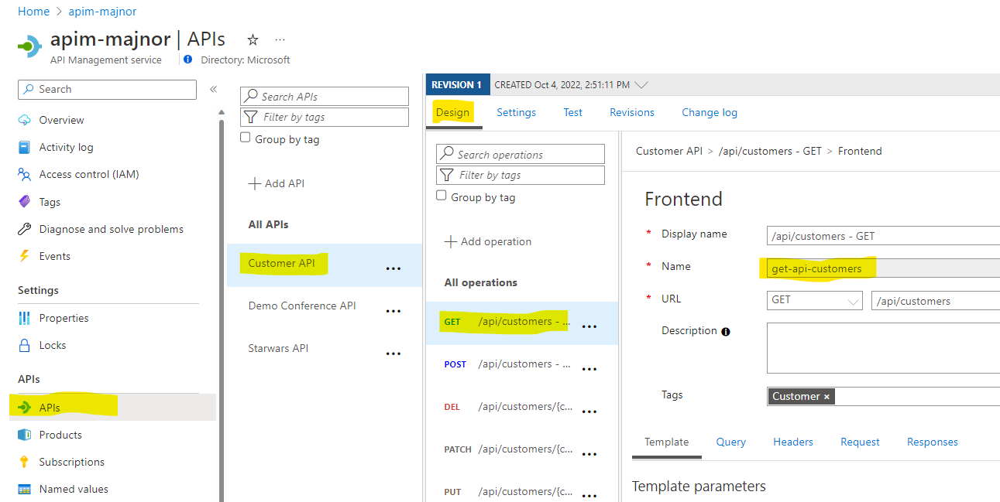

# Challenge 6 - Solution

## Solution steps

Open customer.bicep in VS Code and add the following code. 

```bicep
var operation_policy_xml = '''<policies>
<inbound>
        <base />  
</inbound>
<backend>
        <base />
</backend>
<outbound>
        <base />
        <set-header name="myheader" exists-action="append">
          <value>apimhack</value>
        </set-header>
</outbound>
<on-error>
        <base />
</on-error>
</policies>
'''

var api_policy_xml = '''<policies>
<inbound>
        <base />
        <include-fragment fragment-id="RemoveApimKey" />
</inbound>
<backend>
        <base />
</backend>
<outbound>
        <base />
</outbound>
<on-error>
        <base />
</on-error>
</policies>
'''

var remove_apim_key_xml = '''
<fragment>
  <set-header name="Ocp-Apim-Subscription-Key" exists-action="override">
	  <value> </value>
  </set-header>
</fragment>
'''

```

Working with policies in Bicep can be tricky especially if you need to work with variables inside the policies. Beware of the escaping rules using single quotes, it takes a while to understand how escaping quotes works but after you have figured that out it works like a charm.  

The first variable is the policy for the operation it creates a new request header in the outbound section.
The second variable is the policy for the API, it's referencing the policy fragment created earlier in Challenge 3. 

The next step is to add the first policy to the "api/customers-GET" operation. Here you need to find the id of the operation that the swagger import has created. The id is "get-api-customers" and it will be used to reference the policy.  




Add the following code to customerapi.bicep to reference the operation. 

```bicep
resource operation 'Microsoft.ApiManagement/service/apis/operations@2021-08-01' existing = {
  name: 'get-api-customers'
  parent:api
}
```

The next step is to add the policies to the operation/api. Name must be 'policy' and parent should be different depending on if you want to add the policy to the operation or api. 
 

```bicep
resource api_policy 'Microsoft.ApiManagement/service/apis/policies@2021-08-01' = {
  name: 'policy'
  parent:api
  dependsOn: [
    remove_apim_key
  ]
  properties: {
    value: api_policy_xml
    format: 'xml' 
  }
}

resource operation_policy 'Microsoft.ApiManagement/service/apis/operations/policies@2021-08-01' = {
  name: 'policy'
  parent:operation
  properties:{
    value: operation_policy_xml
    format: 'xml'
  }

}
resource remove_apim_key 'Microsoft.ApiManagement/service/policyFragments@2021-12-01-preview' = {
  name: 'RemoveApimKey'
  parent: apim
  properties: {
    description: 'Removes the API Management Key from the request'
    format: 'xml'
    value: remove_apim_key_xml
  }
}
```
Finally, the remove_apim_key resource deploys the policy fragment that we added manually in the portal. We will need it when we deploy the production environment in challenge 7.
Commit and push the changes, monitor the workflow in GitHub.

Use VS code to validate that the request header "myheader" has been added to the response. Check the traces that the API key has been removed from the call to the backend api. 
If you add the request header "Ocp-Apim-Trace" with value "true" in the validate.http file you get the link to the trace location. There you should find that the "RemoveApimKey" fragment has been added to the API policy.

```
### 
https://apim-[POSTFIX].azure-api.net/ch5/api/customers
Ocp-Apim-Subscription-Key: <Place subscription key here>
Ocp-Apim-Trace: true
```


## The challenges

* [Challenge 1: Setup the environment](challenge1.md)
* [Challenge 2: Get familiar with Azure API Management (APIM)](challenge2.md)
* [Challenge 3: Use Bicep for deployment to APIM](challenge3.md)
* [Challenge 4: Create a CI/CD GitHub Action and deploy to Container Apps](challenge4.md)
* [Challenge 5: Use the CI/CD GitHub Action to deploy changes to APIM](challenge5.md)
* [Challenge 6: Add a policy using Bicep](challenge6.md)
* [Challenge 7: Managing Development/Production environments.](challenge7.md)