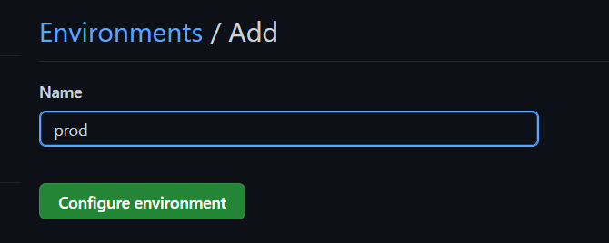
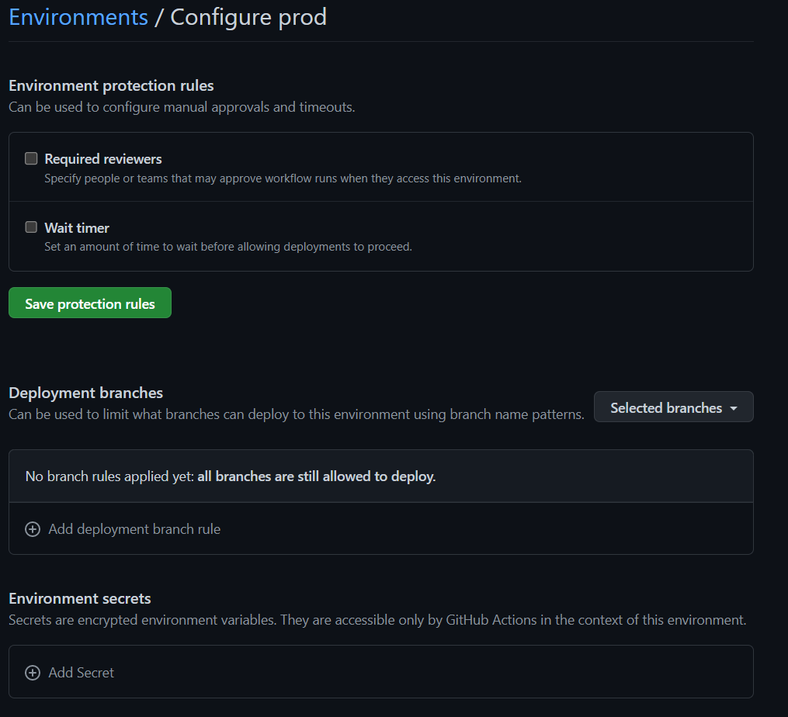
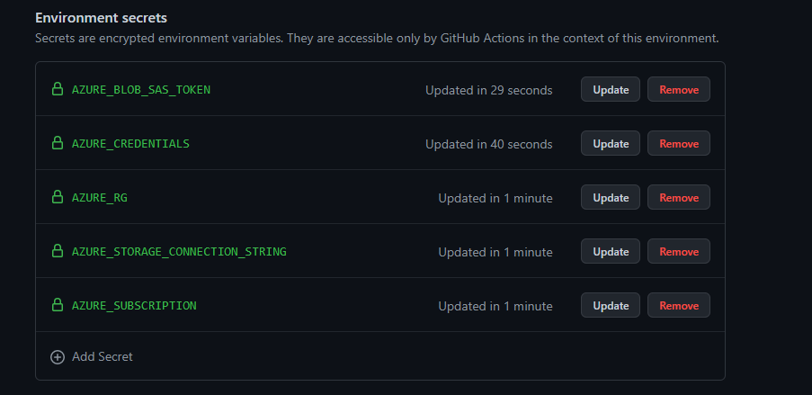
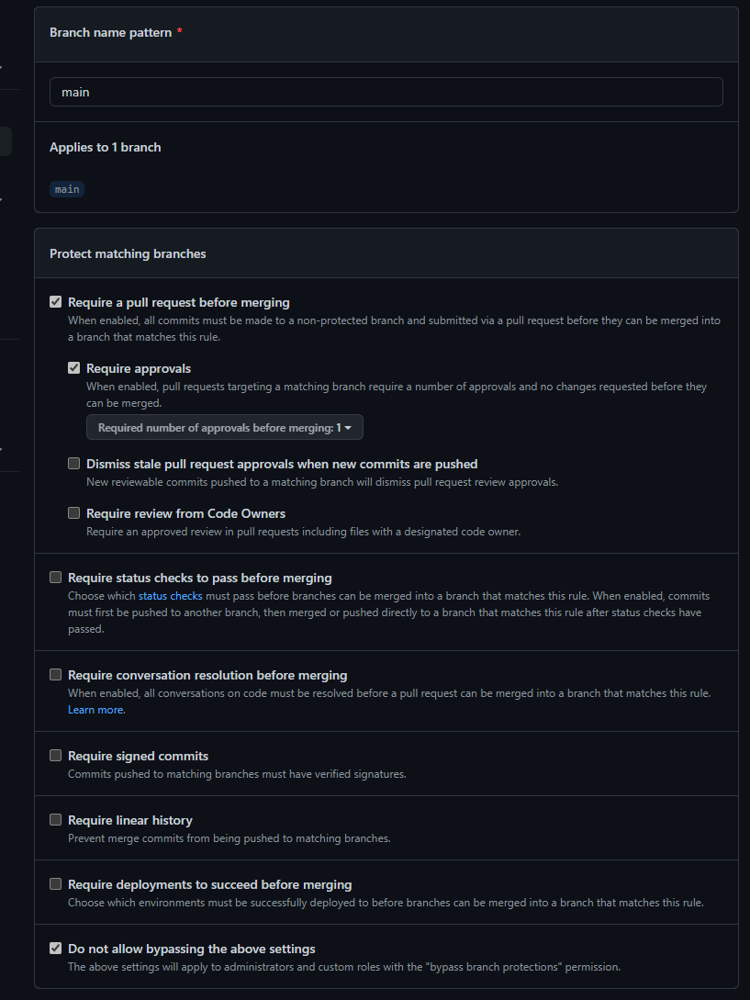
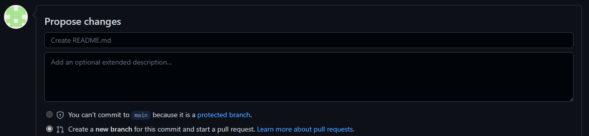

# Challenge 7 - Solution

## Solution steps
### Create a new GitHub Environment
You will now add a new production environment to the GitHub repo. This will ensure that secrets are stored separately from the existing dev environment, and will also enable you to add additional controls for deployment.

Login to your GitHub account and navigate to Settings --> Environments. 
Click "New environment" give it the name "prod" and click "Configure environment"



Under deployment branches, click the "All branches" dropdown and choose "Selected branches"
Then click "Add deployment branch rule", give the branch name pattern "main" and click "Add rule".



We've now configured the prod environment to only allow deployments from the main branch of the repository.

### Provision the production environment in Azure
Provision the production environment in Azure by repeating [Challenge 1: Setup the environment](solution1.md)
> **Note**
> 
> Add "prod" to your POSTFIX, i.e. "majnorprod". Skip the steps for adding GitHub Secrets as described in Challenge 1, we will add them to the GitHub environment instead
>

### Add GitHub secrets to the production envrionment

Now you are going to add five secrets that will be used for the GitHub Action workflow. This time, we will add them as envrionment specific variables instead.
Login to your GitHub account and navigate to Settings --> Environments

Click the "prod" environment. On the Configure environment page, add the secrets under Environment secrets. 
Use [Challenge 1: Setup the environment](solution1.md) for guidance on how to obtain the secrets. 

> **Note**
> Remember to copy the secrets from the newly created prod environment in Azure. 
>



### Modify the deployment pipeline
Let's change our deployment job so that it becomes re-usable. Open the main.yml file in .github/workflows and modify the top part to looks like this. Leave the rest of the file unmodified.


```yaml
   name: Customer Api
   on:
    workflow_call:
      inputs:
       environment:
        type: string
        description: 'Name of the environment'
       name:
        type: string
        description: 'Suffix to use'
  jobs:
    build-and-deploy:
      runs-on: ubuntu-latest
      environment: ${{inputs.environment}}
      env:
        directory: api/CustomerAPI
        name: ${{ inputs.name }} 
```
Add another file called prod.yml in .github/workflows with the following contents:

```yaml
name: Production deploy
on:
  push:
    branches:
    - 'main'
  paths:
    - 'api/CustomerAPI/**' 
    - '.github/workflows/*' 

jobs:
   deploy_to_prod:
    name: 'Production deployment'
    uses: ./.github/workflows/main.yml         #Call the existing workflow 
    secrets: inherit
    with:
      name: [YOUR POSTFIX]prod
      environment: 'prod'                       #Set the envrionment to prod to ensure that we use use secrets from the prod GitHub Environment

```
Add another file called dev.yml in .github/workflows with the following contents:
```yaml
name: Dev deploy
on:
  push:
    branches-ignore:
    - 'main'
    paths:
    - 'api/CustomerAPI/**' 
    - '.github/workflows/*'
jobs:
   deploy_to_dev:
    name: 'Dev deployment'
    uses: ./.github/workflows/main.yml         #Call the existing workflow 
    secrets: inherit
    with:
      name: [YOUR POSTFIX]
      environment: ''   
```
Commit and push the changes.

We've changed the original job to be callable by other workflows with the workflow_call trigger. The new production deploy workflow re-uses our CI/CD workflow on pushes to main, but sets the environment to prod. It is executed as soon as new code is pushed to the main branch.

Another CI/CD workflow has been added that also re-uses the original workflow but deploys to the DEV environment.

### Protect the main branch
Since we're now automatically deploying all code changes from main to production, we should establish a review process. You will now proctect the main branch to ensure that changes are reviewed before they can be merged to main. 

Login to your GitHub account and navigate to Settings --> Branches

Click "Add rule"



On the branch protection rule configuration page, set the branch name pattern to "main". Check the "Require a pull request before merging" and the "Do not allow bypassing the above settings" checkbox. Then click the "Create" button on the bottom of the page.

To validate that this works as expected, click the Code link on the top of the page, then click the Pencil icon next to README.md. At the bottom of your screen, you should see a message similar to this:



### Make a code change

You've protected the main branch and made sure that all changes are reviewed before they are merged. Let's now make a code change to validate that things work as expected. 

In VSCode, create a new branch by executing the following command in a terminal window
```bash
git checkout -b features/iceland
```

Open the file ValidationAttributes/AddressAttribute.cs and add Iceland as a country.

```csharp
if (country != "sweden" && country != "denmark" && country != "norway" && country != "finland" && country != "iceland")
                return new ValidationResult("Country should be among (Sweden, Denmark, Norway, Finland, Iceland)", new[] { "CustomerCreateDto" });

            var phoneNumber = customerCreateDto.PhoneNumber;

            if (country == "sweden" && (!phoneNumber.StartsWith("+46") || !phoneNumber.StartsWith("0")))
                return new ValidationResult("Since the country is Sweden, Phone Number should start with +46 or 0", new[] { "CustomerCreateDto" });
            else if (country == "denmark" && !phoneNumber.StartsWith("+45"))
                return new ValidationResult("Since the country is Denmark, Phone Number should start with +45", new[] { "CustomerCreateDto" });
            else if (country == "norway" && !phoneNumber.StartsWith("+47"))
                return new ValidationResult("Since the country is Norway, Phone Number should start with +47", new[] { "CustomerCreateDto" });
            else if (country == "finland" && !phoneNumber.StartsWith("+358"))
                return new ValidationResult("Since the country is Finland, Phone Number should start with +358", new[] { "CustomerCreateDto" });
            else if (country == "iceland" && !phoneNumber.StartsWith("+354"))
                return new ValidationResult("Since the country is Iceland, Phone Number should start with +354", new[] { "CustomerCreateDto" });
```

For the complete file, see [docs/ch7-AddressAttribute.cs](ch7-AddressAttribute.cs)

Commit the changes and then click Publish Branch. This should trigger the dev deployment workflow.

### Create a Pull Request
Login to your GitHub account and navigate to the repository. 

Navigate to Settings --> Branches. Under Branch protection rules, click the edit button next to "main". In the protect matching branches section,  *uncheck* the "Do not allow bypassing the above settings". Then click the "Save changes" button. This will enable us to merge a Pull Request without approval (since you're doing this hack individually, you will not have anyone who can approve your changes)

On the repo home page, you will see a prompt to create a Pull Request<br>


Click Create. Check the "Merge without waiting for requirements to be met (bypass branch protections) checkbox: 


Click "Merge pull request" and then "Confirm merge".

Validate that the Production deploy workflow is triggered and pushes your code change to the production environment.

Once deployment completes, you can validate it using validate.http by adding a new line that creates a customer with an Icelandic address and phone number.

```
### 
POST https://apim-[POSTFIX].azure-api.net/ch5/api/customers
Ocp-Apim-Subscription-Key: <Place subscription key here>
Content-Type: application/json

{"personalNumber": "1919191919", "email":"someone@email.com","phoneNumber":"+35470274729", "address": {"country": "Iceland", "zipCode": "12345"}}
```
## The challenges

* [Challenge 1: Setup the environment](challenge1.md)
* [Challenge 2: Get familiar with Azure API Management (APIM)](challenge2.md)
* [Challenge 3: Use Bicep for deployment to APIM](challenge3.md)
* [Challenge 4: Create a CI/CD GitHub Action and deploy to Container Apps](challenge4.md)
* [Challenge 5: Use the CI/CD GitHub Action to deploy changes to APIM](challenge5.md)
* [Challenge 6: Add a policy using Bicep](challenge6.md)
* [Challenge 7: Managing Development/Production environments.](challenge7.md)